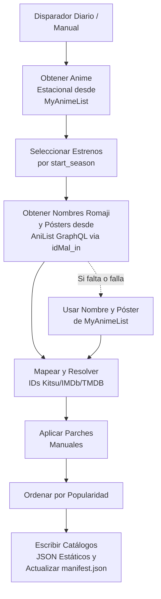
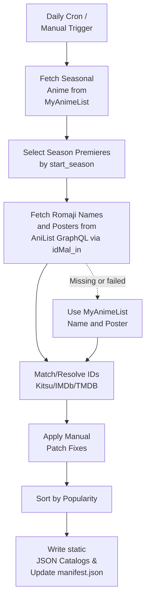

# Animes' Seasons

<p align="center">
  
</p>

Este addon de Stremio muestra catálogos de animes organizados por temporadas (actual y próxima temporada). Es un **fork** del repositorio original [victorgveloso/animes-season-addon](https://github.com/victorgveloso/animes-season-addon) con mejoras y características añadidas.

---

## Español

### Detalles Técnicos y Arquitectura
El addon funciona generando catálogos estáticos que Stremio lee directamente. Estos se actualizan a diario automáticamente mediante GitHub Actions.

#### 1. Flujo de Generación de Datos


#### 2. Especificaciones Técnicas
- **Obtención de Datos (MyAnimeList):** Consulta la base de datos estacional de MyAnimeList, ordena por popularidad de lista (`sort=anime_num_list_users`) y conserva los animes cuyo `start_season` coincide con la temporada solicitada.
- **Metadatos de AniList GraphQL:** Para mostrar nombres romaji y pósters en alta resolución, se realiza una única consulta en bloque usando `idMal_in`. Si no se encuentra un anime o AniList falla, se usa el nombre y póster de MyAnimeList como respaldo.
- **Cadena de Resolución de IDs (IdResolver):** Mapea los animes a identificadores compatibles con Stremio (Kitsu/IMDb) mediante los siguientes pasos recursivos:
  1. **API Yuna (ARM):** Búsqueda rápida de equivalencias de IDs.
  2. **Esquema de Kitsu:** Consulta directa a los mapeos de `anime-kitsu.strem.fun`.
  3. **Búsqueda por Nombre (name-to-imdb):** Algoritmo de rastreo por nombre y año en caso de fallar los anteriores.
- **Parches Manuales (`postprocess/fix/catalog/manual.csv`):** Archivo CSV de correcciones para asociar IDs correctos de forma manual y evitar que se pierdan contenidos del catálogo.
- **Versionado Automático:** El proceso de compilación actualiza automáticamente la versión del addon (`YY.SeasonIndex.0`) cuando detecta un cambio de temporada.

### Instalación en Stremio
1. Copia el siguiente enlace de manifest:
   ```
   https://kevinazhd.github.io/animes-season-addon/manifest.json
   ```
2. Abre Stremio, ve a la sección de **Addons**, pega el enlace en el buscador e instálalo.
3. **Importante:** Asegúrate de tener instalado el addon oficial de **Kitsu** en Stremio para que los enlaces de reproducción y streams se resuelvan correctamente.

---

## English

### Technical Details & Architecture
The addon generates static catalogs that Stremio displays. The catalogs are automatically updated via a daily scheduler (GitHub Actions), avoiding runtime service downtime.

#### 1. Catalog Generation Workflow


#### 2. Technical Specifications
- **Data Fetching (MyAnimeList):** Queries MyAnimeList seasonal data, sorts by list popularity (`sort=anime_num_list_users`), and keeps anime whose `start_season` matches the requested season.
- **AniList GraphQL Metadata:** To display romaji names and high-resolution posters, a single query fetches metadata using `idMal_in`. In case of miss or AniList failure, the MyAnimeList name and poster are used as fallback.
- **ID Resolution Chain (IdResolver):** Dynamically maps media elements to Stremio-compatible IDs (Kitsu/IMDb) using a resolver chain:
  1. **Yuna API Proxy (ARM):** Fast ID mapping lookup using standard sources.
  2. **Kitsu Addon Meta Maps:** Queries `anime-kitsu.strem.fun` schema mappings directly.
  3. **Name Search (name-to-imdb):** Queries name and year backtracking algorithm if other mappings are missing.
- **Manual Patches (`postprocess/fix/catalog/manual.csv`):** A CSV database containing manually mapped IDs to override automated errors and avoid empty catalog entries.
- **Automated Versioning:** The addon automatically bumps its version (`YY.SeasonIndex.0`) whenever a season shift is detected by the generation process.

### How to Install on Stremio
1. Copy the following manifest link:
   ```
   https://kevinazhd.github.io/animes-season-addon/manifest.json
   ```
2. Open Stremio, navigate to the **Addons** section, paste the link into the search bar, and install it.
3. **Important:** Make sure you have the official **Kitsu** addon installed in Stremio so that streams and video links resolve correctly.
